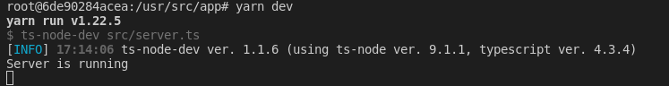

# NLW Valoriza

## 🌱 Projeto

- Nlw Valoriza

> Tecnologias

- `api`
- `node:14`
- `typescript`
- `èxpress`
- `typeorm`
- `sqlite`
- `yarn`
- `docker`
- `beekeeper studio`
- `visual studio code`

## Regras

- Cadastro de usuário

    [ ] Não é permitido cadastrar mais de um usuário com o mesmo e-mail;

    [ ] Não é permitido cadastrar usuário sem e-mail;


- Cadastro de tag

    [ ] Não é permitido cadastrar mais de uma tag com o mesmo nome;

    [ ] Não é permitido cadastrar tag sem nome;

    [ ] Não é permitido o cadastro por usuários que não sejam administradores;


- Cadastro de elogios

    [ ] Não é permitido um usuário cadastrar um elogiao para si;

    [ ] Não é permitido cadastrar elogios para usuários inválidos, o usuário prcisa estar autenticado na aplicação;


> AMbiente de dev a partir de um container

- Executando o container

```console
$ docker run --rm -it -v $(pwd)/:/usr/src/app -p 3000:3000 node:14 bash
```

- Acessando o diretório de trabalho

```console
$ cd /usr/src/app
```

- Criando o projeto com `yarn`

```console
$ yarn init -y
```

> Instalação da dependência e configuração do `typescript`

- Typescript

```console
$ yarn add typescript -D
```

- Inicializando o `typescript`

```console
$ yarn tsc --init
```

- Converter o `typescript` para `javascript`

```console
$ yarn tsc
```

> Instalando o `express`

- Configurando dependência

```console
$ yarn add express
```

- Instalando a biblioteca types do express

```console
$ yarn add @types/express -D
```

> Automatizando o processo de conversão de typescript para javascript

- Instalação da biblioteca responsável pela conversão

```console
$ yarn add ts-node-dev -D
```

- Ajuste do `package.json`

```console
  "scripts" : {
    "dev" : "ts-node-dev src/server.ts"
  }
```

- Rodando o projeto

```bash
$ yarn dev
```



> Criando a rota

> Configurando o Banco de dados

- Instalando dependências

```bash
$ yarn add typeorm reflect-metadata sqlite3
```

> Criando uma entidade 
```bash
$ yarn typeorm migration:create -n CreateUsers
```

> Rodando as migrations
```bash
yarn typeorm migration:run
```

> Revertendo a migration
```bash
yarn typeorm migration:revert
```

> Criando a entidade
```bash
yarn typeorm entity:create -n User
```

> Descomentar no `tsconfig.json`

  -  "experimentalDecorators": true,              
  -  "emitDecoratorMetadata": true,               
  -  "strictPropertyInitialization": false,

> Instalar biblioteca `uuid`
```bash
$ yarn add uuid
$ yarn add @types/uuid -D
```


