## Rotas

> Method POST

- localhost:3000/login
- Autenticando um usuário: na autenticação do usuário, um `token` é gerado.

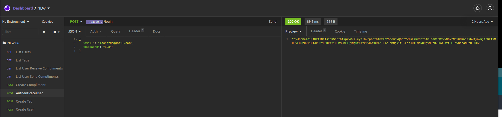

- Ao realizar a autenticação do usuário, um token é gerado, esse token deve ser passado nas rotas que exigem o token para autenticação como a rota em que se cadastra um `elogio`.
- localhost:3000/compliments

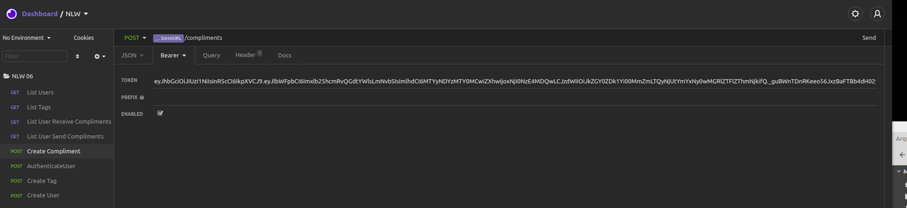

- Criando um `elogio`

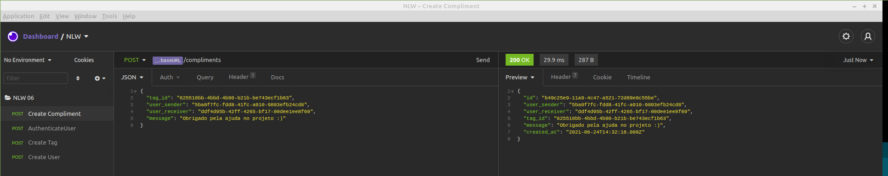

- Criar um elogio para um usuário que não existe.

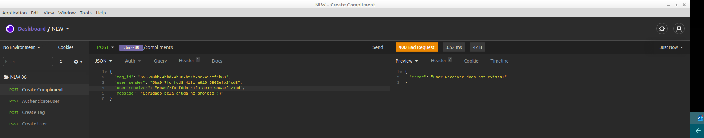

- Criar um elogio para si mesmo

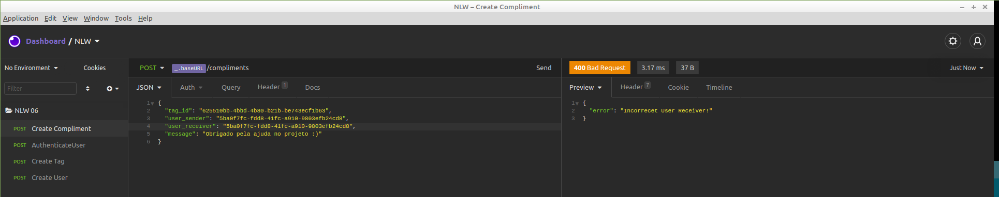

- Assim como para criar um elogio, a criação da tags também deve ter o token passado na requisição.
- Criando uma `tag`
- localhost:3000/tags

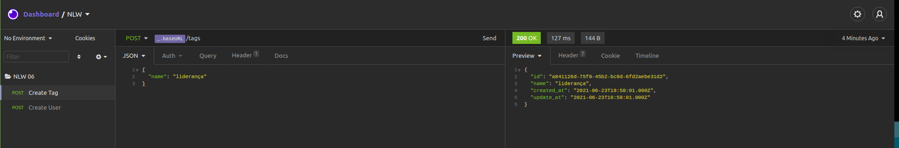

- Somente um usuário `admin` consegue criar `tags`
- Create `users` não admin
- localhost:3000/users

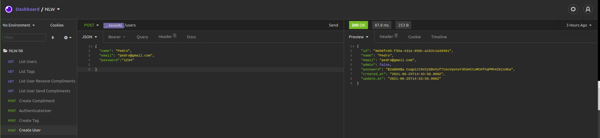

- Tentando criar `tag` com user que não é `admin`

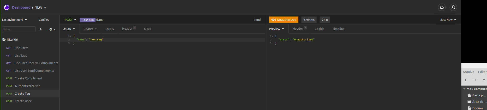

> Method GET

- Listando `elogios` recebidos
- localhost:3000/users/compliments/receive

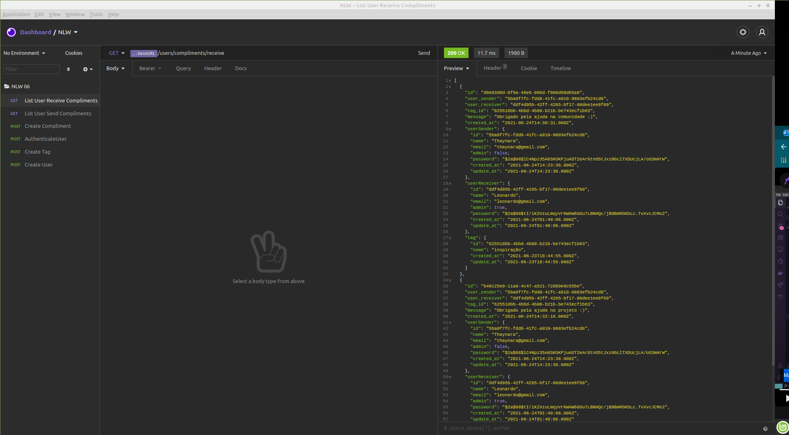

- Listando `elogios` enviados
- localhost:3000/users/compliments/send

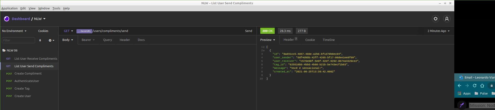

> Para fazer a listagem das tags e users é necessário o token

- Listando `tags` cadastradas
- localhost:3000/tags

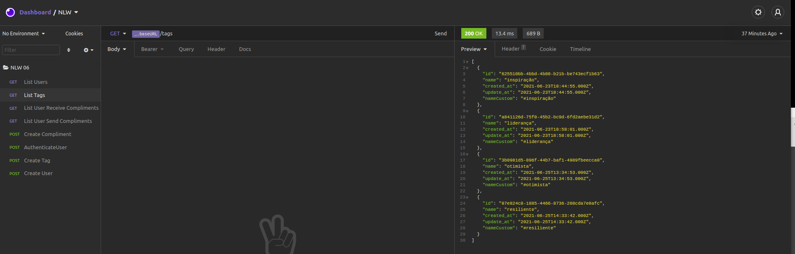

- Listando `users` cadastrados
- localhost:3000/users

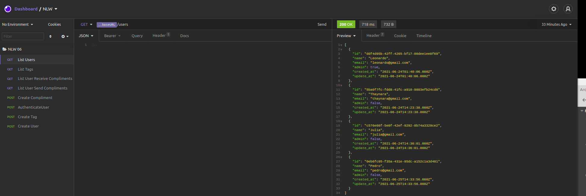